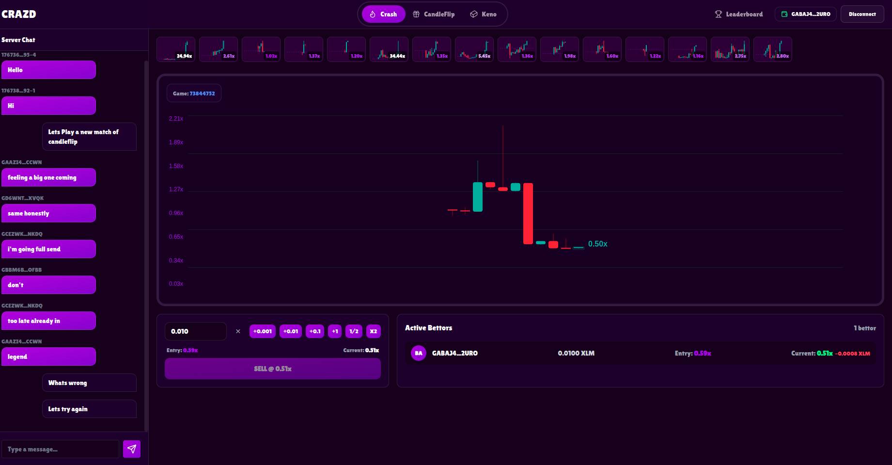
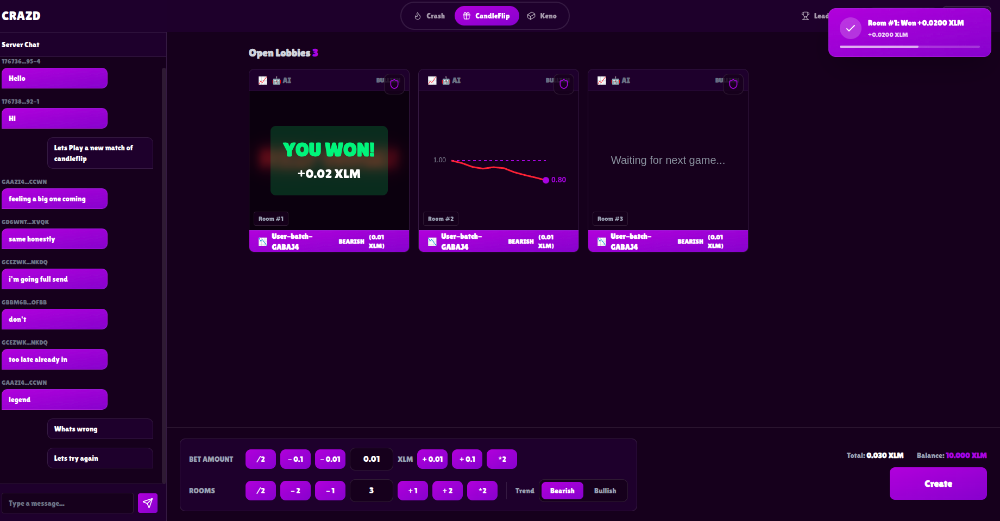
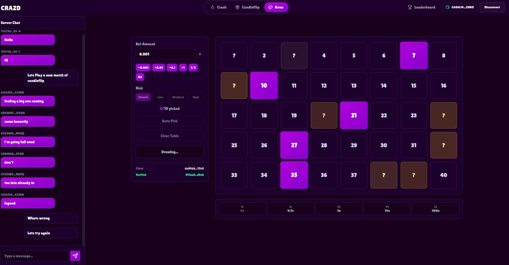
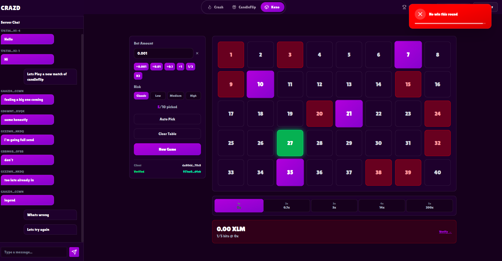

# CRAZD — Bet on-chain. Win on-chain. No middlemen.

> Provably fair multiplayer betting on Stellar. Every outcome verifiable. Every payout instant.

---

## Why CRAZD?

Most crypto betting platforms are just casinos with a blockchain logo slapped on. The house controls the RNG, holds your funds, and pays out whenever they feel like it.

CRAZD is different. Bets go directly into a Soroban smart contract. Outcomes are hash-verified before the round starts. Payouts are on-chain. The house literally cannot cheat — the math is public.

---

## The Games

### Crash
A multiplier climbs from 1x. Could hit 2x. Could hit 100x. Could crash at 1.01x. You decide when to pull out.

- Watch other players bet and bail in real-time
- 60fps live chart
- Cash out at any point before the crash

**The thrill:** You're not betting against a machine. You're betting against everyone else's nerve.

### Candleflip
8 seconds. Bull or bear. Double or nothing.

- 40 price ticks, 200ms each — watch the candle form live
- Multiple rooms run simultaneously
- No waiting around — next round starts immediately

### Keno
40-number board. Pick 1-10 numbers. 4 risk levels (Classic, Low, Medium, High). Provably fair draw.

### Battles
Coming soon.

---

## How It's Built

```
┌──────────────────┐     ┌──────────────────┐     ┌──────────────────┐
│  Next.js 16      │────▶│  Go WebSocket    │────▶│  Stellar/Soroban │
│  React 19        │◀────│  Game Engine     │     │  GameHouse       │
│  Tailwind v4     │     │                  │     │  Contract        │
└──────────────────┘     └──────────────────┘     └──────────────────┘
        │                        │
        ▼                        ▼
┌──────────────────┐     ┌──────────────────┐
│  Freighter       │     │  PostgreSQL       │
│  Wallet          │     │  + Redis          │
└──────────────────┘     └──────────────────┘
```

| Layer | Tech |
|---|---|
| Frontend | Next.js 16, React 19, TypeScript, Tailwind v4 |
| Backend | Go 1.24, Gorilla WebSocket |
| Blockchain | Stellar / Soroban |
| Wallet | Freighter |
| Database | PostgreSQL, Redis |
| Deployment | Render (backend), Vercel (frontend) |

---

## Provably Fair — Actually

Before every round:
1. Server generates a seed and publishes `SHA256(seed)` — locked in before bets open
2. Round plays out
3. Seed is revealed — anyone can verify `SHA256(seed) === committed_hash`

The house **cannot** change the outcome after seeing where players placed their bets. The commitment is on-chain. The math is open source. Don't trust — verify.

---

## Smart Contract

### Overview

**GameHouse** — deployed on Stellar Testnet

| Property | Value |
|---|---|
| Contract ID | `CBHMMQBK6ERVGROJZFHQ56QLBCBWNL5NXLCTV2X2ZBZ5LCWU3ORZUJP3` |
| Network | Stellar Testnet |
| Language | Rust (no_std) / Soroban SDK v25 |
| Build Target | WASM (wasm32v1-none) |

### Contract Functions

| Function | Access | Description |
|---|---|---|
| `initialize(owner, server, token, min_liquidity, max_payout_per_tx)` | One-time | Sets up contract with owner, server keypair, token (XLM SAC), and safety limits |
| `bet(player, amount)` | Player (Freighter-signed) | Places a bet — transfers XLM from player to contract |
| `pay_player(player, amount)` | Server only | Pays out winner — transfers XLM from contract to player |
| `fund_house(funder, amount)` | Anyone | Adds liquidity to the house balance |
| `withdraw_house(amount, to)` | Owner only | Withdraws profits, respects `min_liquidity` floor |
| `set_server(new_server)` | Owner only | Updates authorized game server address |
| `set_paused(paused)` | Owner only | Emergency pause/unpause |
| `get_house_balance()` | View | Current house balance |
| `get_owner()` | View | Owner address |
| `get_server()` | View | Server address |
| `is_paused()` | View | Pause status |
| `get_min_liquidity()` | View | Minimum liquidity threshold |
| `get_max_payout_per_tx()` | View | Maximum single payout |

### Storage Keys

| Key | Type | Purpose |
|---|---|---|
| Owner | Address | Contract admin |
| Server | Address | Game server (authorized for payouts) |
| Token | Address | XLM SAC contract address |
| Paused | bool | Circuit breaker flag |
| HouseBalance | i128 | Current house balance (stroops) |
| MinLiquidity | i128 | Minimum balance floor |
| MaxPayoutPerTx | i128 | Max payout per transaction |

### Security

| Guard | Protects | Effect |
|---|---|---|
| AlreadyInitialized | `initialize()` | Prevents re-initialization |
| ZeroValue | `bet()`, `fund_house()` | Rejects zero/negative amounts |
| Insolvent | `pay_player()` | Fails if amount > balance or > max_payout |
| ContractPaused | `bet()`, `pay_player()` | Blocks all operations when paused |
| WithdrawTooLarge | `withdraw_house()` | Ensures balance - amount >= min_liquidity |
| Soroban Auth | All mutating functions | `require_auth()` on caller |

### Events Emitted

`BetPlaced(player, amount)` | `PlayerPaid(player, amount)` | `HouseFunded(funder, amount)` | `HouseWithdrawn(to, amount)` | `ServerUpdated(new_server)` | `PausedSet(paused)`

### Bet Flow

```
Player (Freighter) ──sign──▶ bet(player, amount) ──▶ XLM locked in contract
                                                          │
Server detects win ──sign──▶ pay_player(player, amt) ─────┘ XLM sent to player
```

No custodial wallets. No withdrawal delays. No rugs (except the game kind).

---

## Feedback

We're actively collecting feedback to improve CRAZD.

**Feedback Form:** [Submit Feedback](https://forms.gle/Lg9U6p5BNW8ehj5m8)

**Response Sheet:** [Feedback Sheet](https://docs.google.com/spreadsheets/d/177kRDxNl4YgsjRSDDxQiOKWv4HiFUHst1IK_m_ZWEfQ/edit?gid=907445802#gid=907445802)

### Feedback Summary (20 responses)

| # | Name | Rating | Features Liked | Issues Found | Feature Requests |
|---|---|---|---|---|---|
| 1 | Arjun Mehta | Loved it | Crash mode, live chart | Slight lag sometimes | Add dark mode |
| 2 | Dev Raj Sharma | Good | Keno fairness | Reconnect issue | Improve reconnect |
| 3 | Riya Sen | Amazing | Leaderboard UI | None | Add achievements |
| 4 | Kunal Shah | Smooth | CandleFlip | Balance not updating | Fix wallet sync |
| 5 | Sneha Roy | Nice | Live chat | Message delay | Add reactions |
| 6 | Rahul Verma | Good | Crash game | Minor lag | Optimize performance |
| 7 | Amit Das | Loved it | Bettors panel | None | — |
| 8 | Raj Malhotra | Okay | Chat | Chat bugs | Fix chat |
| 9 | Priya Kapoor | Very good | Toast notifications | UI lag | Improve animations |
| 10 | Rohit Kumar | Great | Game history | Data delay | Faster updates |
| 11 | Neha Jain | Loved it | Keno modes | None | Add tutorials |
| 12 | Vikram Singh | Good | Betting flow | Occasional lag | Optimize backend |
| 13 | Pooja Sharma | Smooth | Leaderboard | None | — |
| 14 | Ankit Patel | Very nice | CandleFlip | Balance issue | Fix balance |
| 15 | Sarthak Gupta | Nice | Crash UI | Lag spikes | Improve performance |
| 16 | Ayush Rawat | Good | Provably fair | None | Add stats page |
| 17 | Harshit Jain | Average | Keno | UI glitch | Improve UI |
| 18 | Aditya Singh | Good | Real-time betting | Minor delay | Optimize WS |
| 19 | Rohan Gupta | Nice | Crash | None | — |
| 20 | Siddharth Roy | Great | Overall gameplay | None | Add Battles mode |

### Planned Fixes (from feedback)

Based on user feedback, these are the issues we're prioritizing:

- **Fix wallet balance sync** — balance not updating after bets/wins (reported by Kunal, Ankit)
- **Fix WebSocket reconnect** — reconnect is currently a no-op (reported by Dev Raj)
- **Reduce lag / improve performance** — general latency reported across crash and UI (reported by Arjun, Rahul, Sarthak, Vikram, Aditya)
- **Fix chat bugs** — message delay and chat issues (reported by Sneha, Raj)
- **Fix UI glitches** — animation lag and minor UI issues (reported by Priya, Harshit)
- **Faster data updates** — game history and data delay (reported by Rohit)

---

## Live Demo

**App:** [https://crazd.vercel.app](https://crazd.vercel.app)

---

## Screenshots

### Crash

Crash game shown with real time game updates

### CandleFlip

3 games going on — 1 won, 1 in progress, 1 waiting for next round

### Keno — Drawing

Result revealing of the Keno game

### Keno — Win

Choose only 1 correct tile — unable to win prize (prize tiers shown below the board)

## Run It Yourself

### Prerequisites
- Node.js 20+
- Go 1.24+
- PostgreSQL + Redis
- [Freighter](https://freighter.app) browser extension — set to **Testnet**

### Frontend
```bash
cd crash-frontend
npm install
cp .env.example .env
npm run dev
```

### Backend
```bash
cd crash-backend
go mod download
cp .env.example .env
go run main.go
```

### Environment

**`crash-frontend/.env`**
```env
NEXT_PUBLIC_CONTRACT_ID=<soroban contract id>
NEXT_PUBLIC_RPC_URL=https://soroban-testnet.stellar.org
NEXT_PUBLIC_API_URL=http://localhost:8080
NEXT_PUBLIC_WS_URL=ws://localhost:8080
```

**`crash-backend/.env`**
```env
PORT=8080
HOST=0.0.0.0
SERVER_PRIVATE_KEY=<stellar secret key>
CONTRACT_ID=<soroban contract id>
RPC_URL=https://soroban-testnet.stellar.org
DATABASE_URL=postgresql://...
REDIS_URL=<host:port>
REDIS_PASSWORD=...
REDIS_DB=0
```
